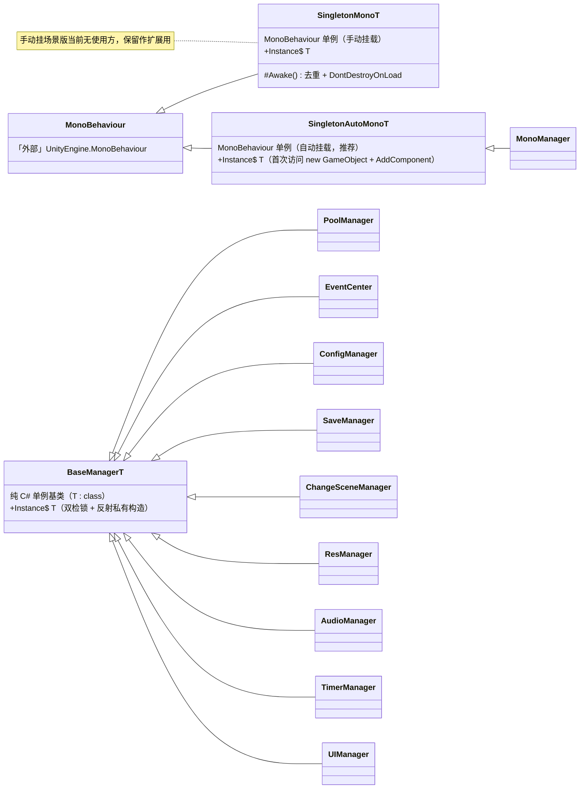
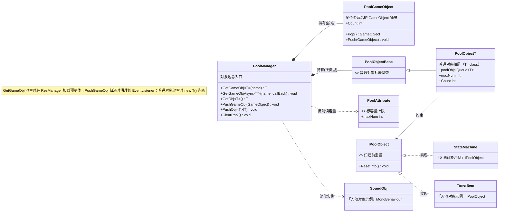
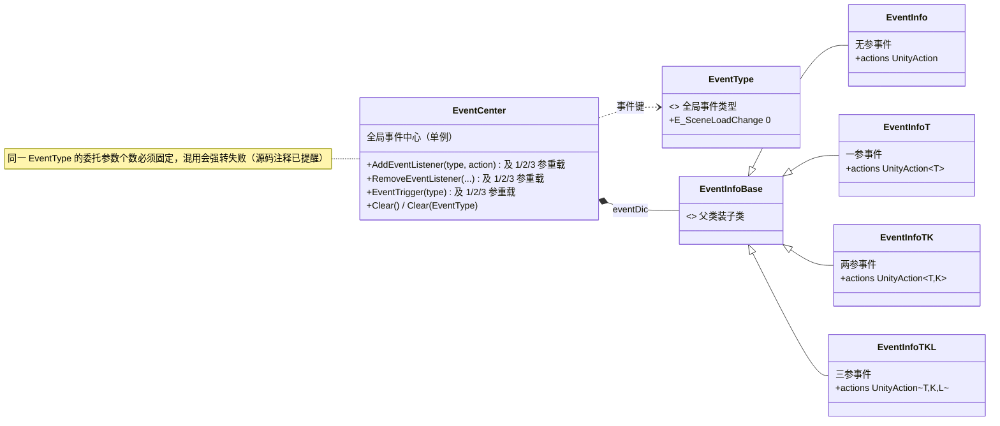
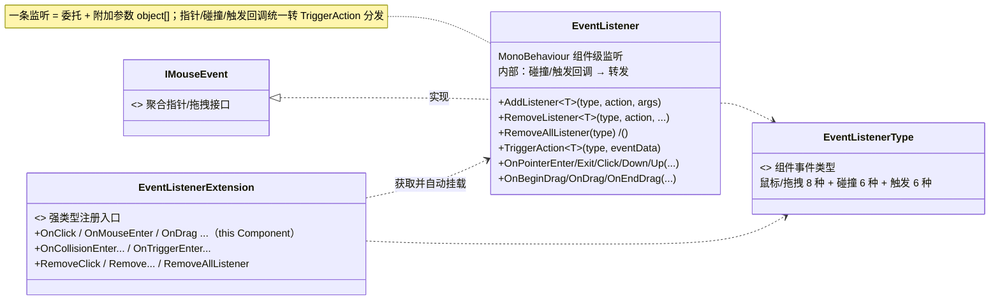
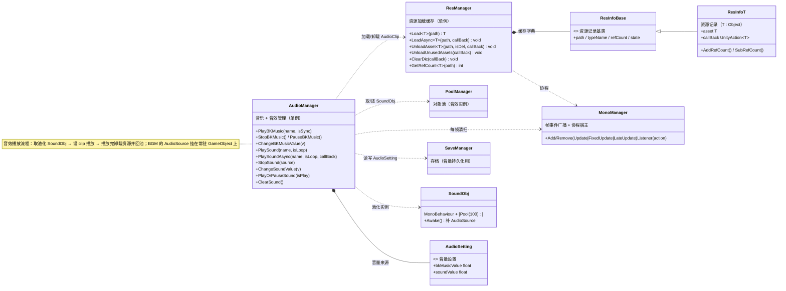
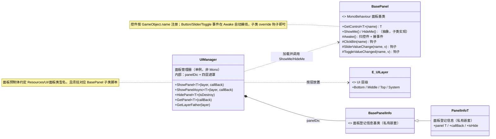
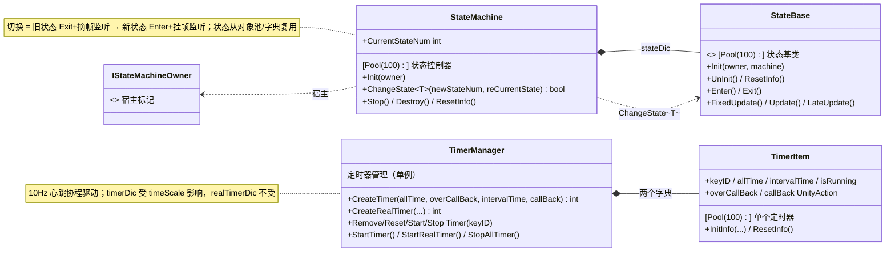
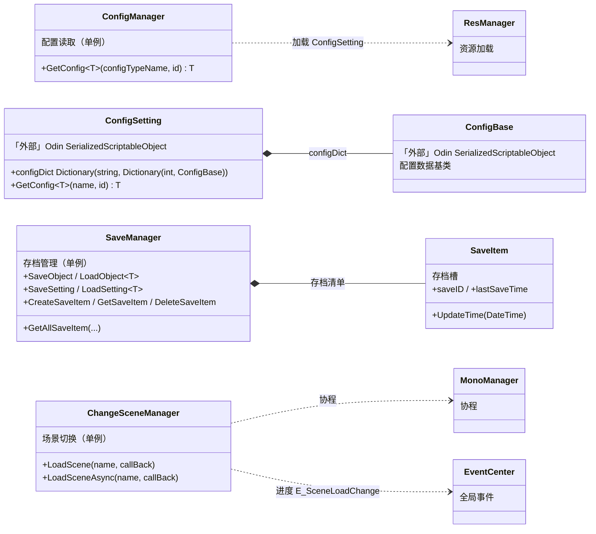
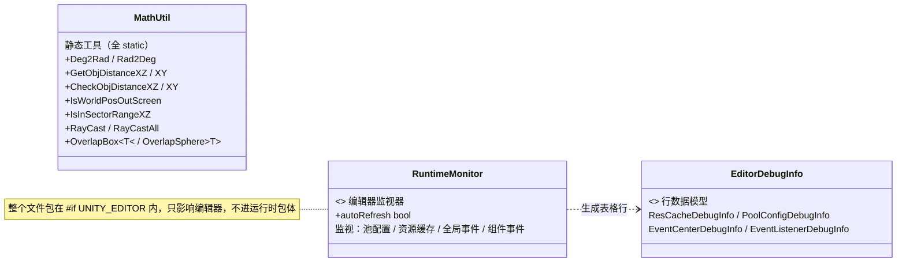

# MSFrame 框架 UML 类图

> 由 `Assets/MSFrame/Scripts` 28 个源文件生成。VS Code 装 “Markdown Preview Mermaid Support” 后 `Ctrl+Shift+V` 预览；Typora / Obsidian / GitHub 直接渲染。

## 目录

- [0. 整体架构](#0-整体架构)
- [1. 单例与生命周期](#1-单例与生命周期)
- [2. 对象池系统](#2-对象池系统)
- [3. 全局事件 EventCenter](#3-全局事件-eventcenter)
- [4. 组件事件 EventListener](#4-组件事件-eventlistener)
- [5. 资源与音频](#5-资源与音频)
- [6. UI 面板系统](#6-ui-面板系统)
- [7. 状态机与定时器](#7-状态机与定时器)
- [8. 配置 / 存档 / 场景切换](#8-配置--存档--场景切换)
- [9. 工具与运行时监视](#9-工具与运行时监视)
- [注意事项](#注意事项)
- [附录 A：类型 → 职责速查](#附录-a类型--职责速查)
- [附录 B：读图符号](#附录-b读图符号)

## 0. 整体架构

```mermaid
flowchart LR
    subgraph USAGE["使用层（业务/组件）"]
        UI["UI 系统：UIManager + BasePanel"]
        COMP["组件：EventListener / StateMachine / TimerManager"]
    end

    subgraph SERVICE["服务层（核心枢纽）"]
        ResM["ResManager\n资源加载缓存"]
        AudioM["AudioManager\n音乐音效"]
        MonoM["MonoManager\n帧事件 + 协程宿主"]
        PoolM["PoolManager\n对象池"]
    end

    subgraph SYS["系统层"]
        EventC["EventCenter\n全局事件"]
        ConfigM["ConfigManager\n配置读取"]
        SaveM["SaveManager\n存档"]
        SceneM["ChangeSceneManager\n切场景"]
    end

    subgraph BASE["基础层"]
        Singleton["单例基类 ×3"]
        Ext["Extension\n扩展方法门面"]
    end

    MonoM -.继承.-> Singleton
    ResM -.继承.-> Singleton
    AudioM -.继承.-> Singleton
    PoolM -.继承.-> Singleton
    EventC -.继承.-> Singleton
    ConfigM -.继承.-> Singleton
    SaveM -.继承.-> Singleton
    SceneM -.继承.-> Singleton

    UI --> ResM : 加载面板预制体
    UI --> EventC : 业务事件
    COMP --> MonoM : 帧驱动/协程
    COMP --> PoolM : 取还对象
    AudioM --> ResM : 加载 AudioClip
    AudioM --> PoolM : 音效实例池
    AudioM --> MonoM : 每帧清扫
    AudioM --> SaveM : 音量设置
    SceneM --> MonoM : 协程
    SceneM --> EventC : 进度事件
    ConfigM --> ResM : 加载配置资产
    PoolM --> ResM : 加载预制体
    MonoM --> Ext : 转发
    PoolM --> Ext : 转发

    style BASE fill:#e8f0fe,stroke:#8ab4f8
    style SYS fill:#e6f4ea,stroke:#81c995
    style SERVICE fill:#fef7e0,stroke:#fdd663
    style USAGE fill:#f3e8fd,stroke:#d7aefb
```

## 1. 单例与生命周期



## 2. 对象池系统



## 3. 全局事件 EventCenter



## 4. 组件事件 EventListener



## 5. 资源与音频



## 6. UI 面板系统



## 7. 状态机与定时器



## 8. 配置 / 存档 / 场景切换



## 9. 工具与运行时监视



## 注意事项

- **事件**：`EventCenter` 同一 `EventType` 的委托参数个数必须固定（0/1/2/3 参对应不同 `EventInfo` 子类），混用会强转失败。
- **对象池**：入池须同时满足 `[Pool(maxNum)]` 特性 + 实现 `IPoolObject`（提供 `ResetInfo`），缺一会打 Warning 拒绝入池；`PushGameObj` 用 `obj.name` 作字典键，取/还必须同一资源名。
- **单例**：`BaseManager<T>` 子类必须声明**私有无参构造**（供反射调用）；`SingletonMono<T>` 无懒加载，场景加载完成前 `Instance` 可能为 null。
- **状态机**：宿主须实现 `IStateMachineOwner`；`ChangeState<T>` 要求 `T : StateBase, new()`，状态经对象池复用。
- **定时器**：10Hz（100ms）心跳离散累减，毫秒值需能被 100 整除才精确；`timerDic` 受 timeScale 影响，`realTimerDic` 不受。
- **UI**：面板预制体须放 `Resources/UI/面板类型名` 且挂对应 `BasePanel` 子类；控件以 `GameObject.name` 为键，同名只登记第一个。
- **音频**：`SoundObj` 走对象池，池满归还会被销毁；BGM 的 AudioSource 挂在常驻 GameObject（DontDestroyOnLoad）上。
- **编辑器**：`RuntimeMonitor` 整个文件在 `#if UNITY_EDITOR` 内，不进运行时包体。
- **资源**：`ResManager` 缓存键 = `path + "_" + 类型 FullName`；采用引用计数，异步加载用协程（由 `MonoManager` 托管）。

## 附录 A：类型 → 职责速查

| 功能域 | 类型 | 一句话职责 |
|---|---|---|
| 单例 | `BaseManager<T>` | 纯 C# 单例（双检锁 + 反射私有构造） |
| | `SingletonMono<T>` | MonoBehaviour 单例（手动挂载去重） |
| | `SingletonAutoMono<T>` | MonoBehaviour 单例（自动挂载） |
| 对象池 | `PoolManager` | 池总入口（取/还/清空） |
| | `PoolGameObject` | 一个资源名的 GameObject 抽屉 |
| | `PoolObject<T>` / `PoolObjectBase` | 普通对象抽屉 / 多态基类 |
| | `PoolAttribute` / `IPoolObject` | 容量特性 / 重置接口 |
| 事件 | `EventCenter` + `EventInfo*` | 全局广播（0~3 参） |
| | `EventListener` + `EventListenerExtension` | 组件级监听（挂物体上） |
| 资源 | `ResManager` + `ResInfo<T>` | 资源加载缓存 + 引用计数 |
| 音频 | `AudioManager` / `SoundObj` / `AudioSetting` | 音乐音效 / 池化载体 / 音量设置 |
| UI | `UIManager` / `BasePanel` / `E_UILayer` | 面板管理 / 面板基类 / 层级 |
| 状态机 | `StateMachine` / `StateBase` / `IStateMachineOwner` | 状态切换 / 状态基类 / 宿主标记 |
| 定时器 | `TimerManager` / `TimerItem` | 倒计时管理 / 单条定时器 |
| 配置 | `ConfigManager` / `ConfigSetting` / `ConfigBase` | 配置读取 / 配置资产 / 配置基类 |
| 存档 | `SaveManager` / `SaveItem` | 存档读写 / 存档槽 |
| 场景 | `ChangeSceneManager` | 同步/异步切场景 |
| 驱动 | `MonoManager` | 帧事件广播 + 协程宿主 |
| 扩展 | `Extension` | 通用扩展方法门面 |
| 工具 | `MathUtil` / `RuntimeMonitor` | 数学工具 / 编辑器监视器 |

## 附录 B：读图符号

| 符号 | 含义 |
|---|---|
| `+` / `-` / `#` / `$` | public / private / protected / static |
| `~T~` | 泛型（如 `Load~T~` = `Load<T>`） |
| `<<abstract>> / <<interface>> / <<enumeration>> / <<static>> / <<attribute>>` | 抽象类 / 接口 / 枚举 / 静态类 / 特性 |
| `A <\|-- B` | B 继承 A |
| `A <\|.. B` | B 实现接口 A |
| `A *-- B` | 组合（强持有） |
| `A ..> B` | 依赖 / 调用 |
| `A --> B` | 关联 |
